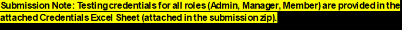

# Project Management Application (Django)

**Live Demo:** https://project-management-django-production.up.railway.app

### ⚠️ IMPORTANT: [IMPORTANT_PROJECT_OPERATIONS_AND_SECURITY_MANUAL](./IMPORTANT_PROJECT_OPERATIONS_AND_SECURITY_MANUAL.pdf)

**This project contains strict business logic and security protocols. Please review the linked manual first for testing
credentials and deployment architecture.**

---

## 🛡️ Executive Summary of Business Rules

## 🛡️ Business Rules & Security Policy

- Restricted Admin Access: Admins are pre-configured and cannot be created via the public registration form.
- Role-Based Permissions: **Admins:** Delete projects and manage user status.
- Managers: Create and assign projects/tasks.
- Data Integrity: Implements **Cascading Deletes**; deleting a project removes all associated tasks.
- Security Protocol: Admin passwords cannot be reset via the public email tool.
- Users are automatically logged out when accessing a password reset link for session safety.

## Overview

A fully functional project management tool built with Django, PostgreSQL, HTML, CSS and Javascript featuring secure
authentication, role-based
access control, and an internal messaging system that allows users to manage projects, tasks, and communicate via an
internal messaging system.

## 🚀 Features

### User Management

- User registration and login
- Role-based access (Admin, Manager, Member)
- Password reset via email
- Profile management
- Passwords stored using Django’s encrypted hashing
- CSRF protection enabled for all AJAX requests

### Project & Task Management

- Managers can create projects and create and assign tasks
- Tasks include status, priority, and due date
- Members see assigned tasks on their dashboard and update as needed
- Admins can delete projects (with cascading task deletion)

### Messaging System

- One-to-one messaging between users
- Recent chats list
- AJAX-based message sending
- Polling every 30 seconds for new messages

### Admin Panel

- System-wide dashboard with statistics
- View and manage all projects
- Enable/disable users
- Full oversight of system data

## Technology Stack

- **Backend:** Django
- **Database:** PostgreSQL (schema managed manually via SQL)
- **Frontend:** HTML, Bootstrap 5, JavaScript
- **Authentication:** Django authentication system
- **Hosting:** Railway.com [https://railway.com/]

## Database Design

Business related Database tables are managed manually using SQL.
Django models are mapped with `managed = False`.

Authentication related tables are managed via Django

sql schema is in - `project_management.sql` with all the static data

## Local Installation

1. Clone the repository.
2. Install dependencies: `pip install -r requirements.txt`.
3. Set up environment variables for `EMAIL_HOST_USER` and `EMAIL_HOST_PASSWORD`.
4. Update the database string in `settings.py`
5. Run queries from `project_management.sql`
6. Run `python manage.py migrate`.
7. If running on localhost server you might need to comment line 154 & 156 in `settings.py` - SECURE_PROXY_SSL_HEADER &
   SECURE_SSL_REDIRECT
8. Start server: `python manage.py runserver`.
9. Access app at: `http://127.0.0.1:8000/`

